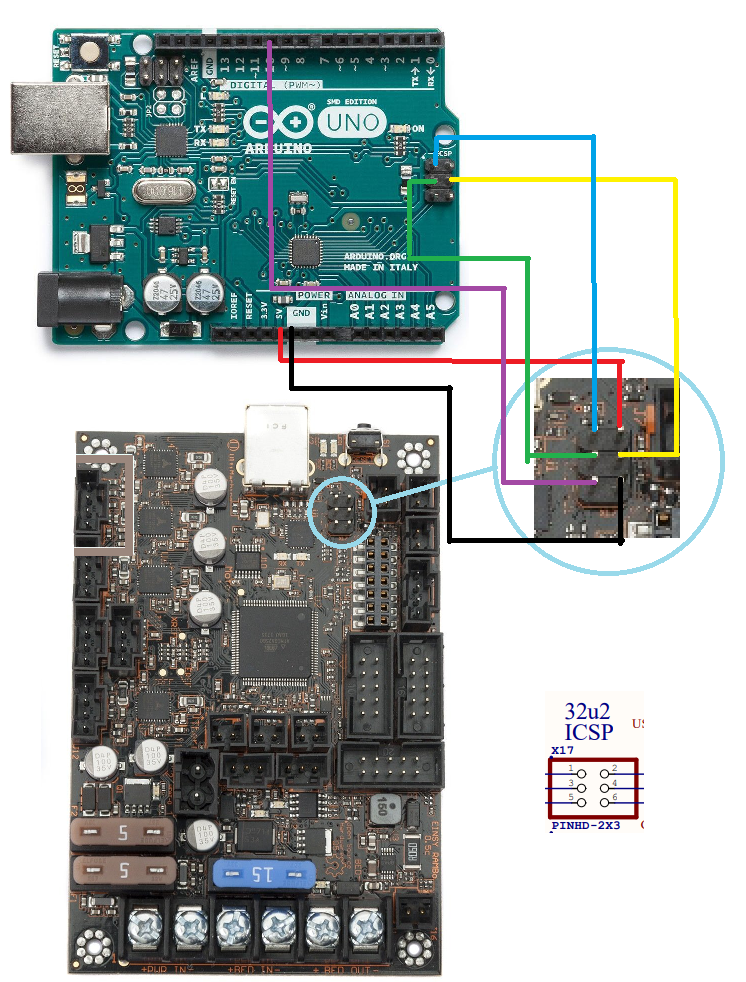

# mk3-32u2-firmware

DFU and USB Serial firmware for Arduino based devices that use an Atmel 8/16/32u2 MCU as a usb to serial bridge.  This firmware addresses USB disconnection issues commonly seen with the Prusa i3 MK3.  All source in this repository is built against LUFA (C) Dean Camera, pulled on 12-28-2018.

The hoodserial usb firmware in this repository is a port from Nico Hood's Hoodloader2.  The original fastserial implementation is courtesy of Urja Rannikko.

Pre-requisites
--------------

You will need a programmer to install the firmware using the instructions below.  It is also possible to flash the usbserial firmware using DFU mode, however it requires pulling the HWB pin on the Atmega32u2 to ground, which is beyond the scope of this document.

The instructions in this document will assume you are using an Arduino Uno as a programmer, in which case you will need an Uno and 6 dupont jumpers (3 male to female, 3 female to female).  To set up an Arduino Uno as a programmer you need to upload the ArduinoISP sketch in the Arudino Examples.  See the [linked tutorial](https://docs.arduino.cc/built-in-examples/arduino-isp/ArduinoISP/) for more information.

This document assumes that you are connecting your programmer to a Linux machine, such as a Raspberry Pi.

Wiring
------

Before wiring, make sure both the programmer and MK3 are not connected to anything via USB.  Also disconnect the power from the MK3.  During this procedure the programmer will power the 32u2, so it is not necessary to power the MK3 on until flashing is complete.

The image and table below demonstrates how to hook up the Arduino Uno to the Einsy Rambo:



| Uno Pin | Einsy ICSP Pin | Color |
|---------|-----------|-------|
| MISO | Pin 1 (MISO) | Blue |
| +5v | Pin 2 (USBVCC) | Red |
| SCK | Pin 3(SCK) | Green |
| MOSI | Pin 4(MOSI) | Yellow |
| Pin 10  | Pin 5 (Reset)| Purple |
| Ground | Pin 6 (Ground) | Black |

If using a dedicated programmer the information above may be used as a refererence for determining the correct wiring.  For example, the table below shows USBasp connections:

| USBasp | | Einsy ICSP|
|--------|-|-----------|
| Pin 1 | MOSI | Pin 4 |
| Pin 2 | VCC | Pin 2 |
| Pin 4 | GND | Pin 6 |
| Pin 5 | Reset  | Pin 5 |
| Pin 7 | SCK | Pin 3 |
| Pin 9 | MISO | Pin 1|

Now you are ready to connect your programmer/Arduino to USB.

Backing up the Atmega32u2
--------------------------

Prior to flashing it is wise to make a complete backup of the current firmware on the atmega32u2.  The following commands demonstrate one method of doing so. Note that these commands assume you are using an Arduino as an ISP.

```
cd ~
mkdir mk3_32u2_backup
cd mk3_32u2_backup
avrdude -p m32u2 -F -P /dev/ttyACM0 -b 19200 -c avrisp -U flash:r:firmware_backup.hex:i -U eeprom:r:eeprom.hex:i -U lfuse:r:lowfuse:h -U hfuse:r:highfuse:h -U efuse:r:exfuse:h -U lock:r:lockfuse:h
```

If your are using a different programmer change `-c avrisp` to `-c <programmer>`, where the programmer is the correct identifier.  You may also need to change the port `-P /dev/ttyACM0` and change/remove the baudrate `-b 19200`. Below is an example using an AVR Dragon USB programmer:
```
avrdude -p m32u2 -F -P usb -c dragon_isp -U flash:r:firmware_backup.hex:i -U eeprom:r:eeprom.hex:i -U lfuse:r:lowfuse.hex:i -U hfuse:r:highfuse.hex:i -U efuse:r:exfuse.hex:i -U lock:r:lockfuse.hex:i
```

Flashing the new firmware
--------------------------

Prior to flashing, the high fuse bits need to be set to ensure that the EEPROM is not erased.

```
avrdude -p m32u2 -F -P /dev/ttyACM0 -b 19200 -c avrisp -U hfuse:w:0xD1:m
```

Now fetch and flash the firmware:

```
wget https://raw.githubusercontent.com/PrusaOwners/mk3-32u2-firmware/master/hex_files/DFU-hoodserial-combined-PrusaMK3-32u2.hex
avrdude -p m32u2 -F -P /dev/ttyACM0 -b 19200 -c avrisp -U flash:w:DFU-hoodserial-combined-PrusaMK3-32u2.hex -U lfuse:w:0xFF:m -U hfuse:w:0xD9:m -U efuse:w:0xF4:m
```

This will flash the firmware and reset the fuses back to their default state.  Note that high fuse is reset with the EESAVE bit disabled, so a reflash would erase EEPROM unless the high fuse is set back to 0xD1 first.

Verify the installation
-----------------------
Remove the programmer's jumper connections from the Einsy, connect your MK3 to the Pi via USB, and restore power to the MK3.  Run:

```
dmesg | tail
```

You should see output similar to the following:

```
[961589.746605] usb 1-1.4: New USB device found, idVendor=2c99, idProduct=0002
[961589.746619] usb 1-1.4: New USB device strings: Mfr=1, Product=2, SerialNumber=3
[961589.746628] usb 1-1.4: Product: Original Prusa i3 MK3
[961589.746637] usb 1-1.4: Manufacturer: Prusa Research (prusa3d.com)
[961589.746645] usb 1-1.4: SerialNumber: <YOURSERIALNUMBER>
[961589.747618] cdc_acm 1-1.4:1.0: ttyACM0: USB ACM device
```

Building the DFU Bootloader and Hoodserial for the MK3 Einsy
------------------------------------------------------------
It is recommended to build on a linux machine, or on a windows machine using the Windows Subsystem for Linux.  Make sure you have avr-gcc and avr-libc installed:
```
sudo apt install avr-gcc avr-libc
```

There are two makefiles that need to be correctly changed. In the dfu-bootloader directory, make sure the following options are applied to the makefile:

```makefile
MCU          = atmega32u2

EXTRA_OPTS = -DVENDORID=PRUSA_VID
EXTRA_OPTS += -DPRODUCTID=PRUSA_MK3_PID
```

Save and run `make`.

Now edit the makefile in the hoodserial directory:

```makefile
MCU          = atmega32u2

HOODSERIAL_OPTS = -DVENDORID=PRUSA_VID
HOODSERIAL_OPTS += -DPRODUCTID=PRUSA_MK3_PID
HOODSERIAL_OPTS += -DPRUSA_MK3_SERIAL
```

Save and run `make`.

This should result in several outputs, however we are interested in `dfu-bootloader.hex` and `hoodserial.hex`.  You must remove the last line of `hoodserial.hex`, it should be `:00000001FF`.  This can be done with a standard text editor.

They now need to be concatenated. There are many methods for doing this, I find that using the HxD utility works well in Windows.  There is a built in concatenate utility in `Tools->File Tools`.  When concatenating, `hoodserial.hex` should be first, followed by the`dfu-bootloader.hex` file.

This firmware can also be built for the Arduino Mega or Uno.  The makefiles will need to be changed to the appropriate MCU (typically Atmega16u2), vendor, and product IDs. You will also want to make sure that the PRUSA_MK3_SERIAL definition is removed.

Note that this repo doesn't have built in support for Ultimachine's product and vendor strings.  Firmware can be built for it using the Arduino Mega's strings.  Follow the same instructions as above, however use Atmega32u2 instead of Atmega16u2
